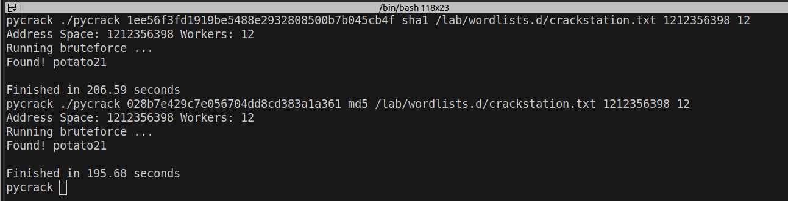

# pycrack

### pycrack is an easy to use password cracking tool that don't rely on GPU.  

### Algorithms supported
* blake2b  
* blake2s
* md5  
* sha1  
* sha224  
* sha256  
* sha384  
* sha3_224  
* sha3_256  
* sha3_384  
* sha3_512  
* sha512  
* shake_128  
* shake_256


#### Usage:
```
./pycrack [hash] [algorithm] [wordlist] [wordlist lenght] [workers]

```

### Example: 
```bash
./pycrack 028b7e429c7e056704dd8cd383a1a361 \
md5 \
/lab/wordlists.d/crackstation.txt \
1212356398 \
12
```


